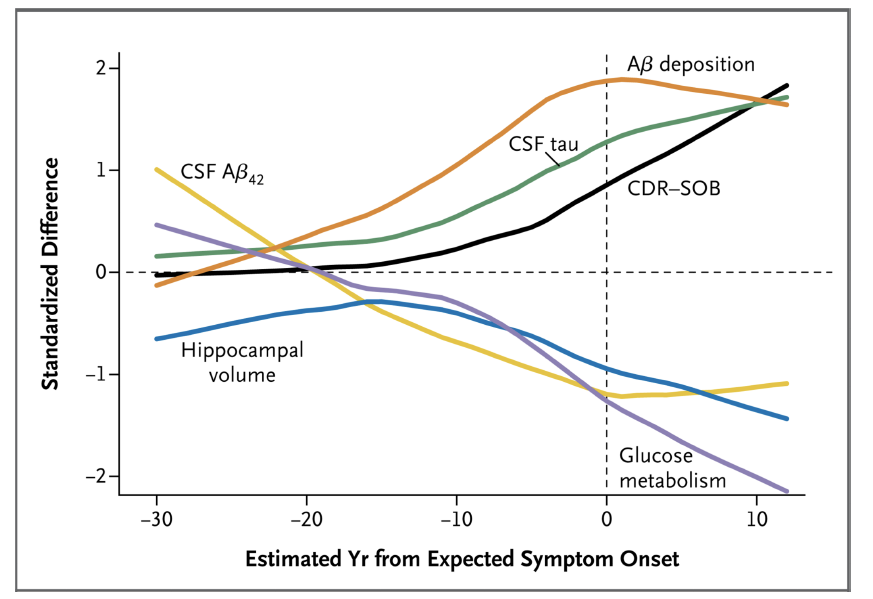

# 20190507 points discussed with Frank-Erik

* Fill in the Hoar est Form after adding Marco Deuring as our co-promoter; then sign it later by FE, Marco for me
* Marjan on data monitor :
  * How do you determine the all-cause mortality from all vascular causes?——Dutch Municipal Personal Records database
  * Adverse effects, time frame and check it with Mayran\_ add this point to CMO \(and reply Marjan\)
  * How to evaluate incident dementia, parkinsonism, and all-cause mortality; not from questionnaire
  * Mail Marjan with our replies concerning her questions
* Walter appointment \_He advised us to visit Masstricht
  * visit the Masstricht, it is better for Marco and Anil to join, Josen?
  * FE told us: Make one appointment with these person by contacting with Walter's secretary
  * choose the optimal MRI scanner
* Biobank issues:
* * Two forms will be filled in this week :
    * Sub-biobank
    * Informed consent form
  * old DNA samples for RUN DMC \_ GWAS analysis, collaboration with other international groups
  * Don't need DNA samples any more from the 4th wave RUN DMC
  * Decrease the blood volume we need, 15ml x 2 time \(forp plasma and serum\) is needed. Therefore, change the blood volume needed in CMO protocol accordingly.
  * Also changen the All-cause mortality from all vascular causes, into “All-cause mortality, including all vascular causes”.

From Siem Biobank§ Remove 6 ml of EDTA \(purple cap\)· Plasma \(last time it was EDTA plasma\):§ Remove 10 ml of EDTA \(purple cap\)· Serum \(last time too, now again?\):§ Remove 10 ml of dry tube \(ocher yellow cap\) These 3 tubes? Is that right?Without time T1 or T2 etc.

* Master student from biology studnet\_Applied scicence\_Jorgen
  * Not accepted, not fit in what we need, coz we need the students who will do a lot of pragmatic work
* advanced stats course in the summer
  * Based on the current project, ask the the specific questions
* TSP form:
  * brief discussion on objectives \(collaboration with Mayra\)
    * If we have do so many comparisons, we have to correct it, in this case, some significance may be gone
    * Multiple linear regression is encouraged, if there are the interactions between these risk factors, say multicollinearity, then we can try to use random forest
    * Framingham risk score is ad vised from Mayra, but it is not very convincing and closely related to our main research question
  * Anatomical progression of lacunes and microbleeding
  * How to find my contract number
  * Send FE Mengfei's TSP plan
  * draft the researchh plan with a broad but clear structure and objectives
    * not confine the research topics only in vascular risk factors, other predictors, including the endothelial cells, BBB function may need to be included.
    * the project title maybe : the progression of SVD
* Suggestions from Marco
  * Marco advise us to re-evaluate the lacunes, including the lacunes volume, for the accurancy. But it will take a lot of time and energy
  * Marco also advised that regarding the BMI, we can not only stratify these data, but also use the BMI continuous data directly
  * By using linear mixed effect model, we can take the risk factos, like smoking, as the fixed effecct, to assess the effects of risk factors on the progression of SVD \( imaging markers\); Meanwhile, we may also take the interaction \(smoking x alcohol\)as the fixed effect
  * dynamic curve on risk factors and imaging markers;
  * [https://www.ncbi.nlm.nih.gov/pmc/articles/PMC3474597/](https://www.ncbi.nlm.nih.gov/pmc/articles/PMC3474597/)
  *  Comparison of Clinical, Cognitive, Structural, Metabolic, and Biochemical Changes as a Function of Estimated Years from Expected Symptom Onset

